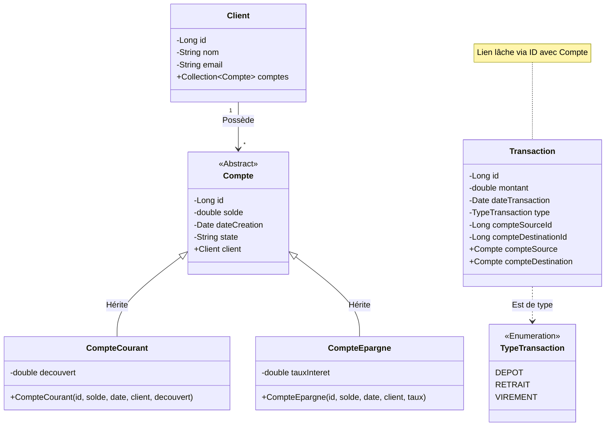

# Rapport de Projet Complet : Digital Banking Application

**Réalisé par :**
- KHARRAZ Kenza
- MOUGHIT Aya

**Date :** 16 Décembre 2025

---

## Table des Matières

1.  [Introduction Générale](#1-introduction-générale)
    *   1.1 Contexte du Projet
    *   1.2 Objectifs
    *   1.3 Périmètre Fonctionnel
2.  [Architecture du Système](#2-architecture-du-système)
    *   2.1 Architecture Microservices
    *   2.2 Patterns d'Architecture Utilisés
        *   2.2.1 Service Discovery (Eureka)
        *   2.2.2 API Gateway
    *   2.3 Diagramme d'Architecture Global
3.  [Choix Technologiques](#3-choix-technologiques)
    *   3.1 Backend (Spring Boot & Cloud)
    *   3.2 Base de Données (H2)
    *   3.3 Outils de Développement (Lombok, Maven)
4.  [Analyse Détaillée des Microservices](#4-analyse-détaillée-des-microservices)
    *   4.1 Service d'Enregistrement (Discovery Service)
    *   4.2 Passerelle API (Gateway Service)
    *   4.3 Service de Gestion des Comptes (Compte Service)
    *   4.4 Service de Gestion des Transactions (Transaction Service)
5.  [Conception et Modélisation](#5-conception-et-modélisation)
    *   5.1 Diagramme de Cas d'Utilisation
    *   5.2 Diagramme de Classes
6.  [Communication Inter-Services](#6-communication-inter-services)
    *   6.1 OpenFeign
    *   6.2 REST APIs
7.  [Conclusion et Perspectives](#7-conclusion-et-perspectives)

---

## 1. Introduction Générale

### 1.1 Contexte du Projet

Le secteur bancaire traverse une transformation numérique majeure. Les clients exigent désormais des services accessibles 24h/24 et 7j/7, sécurisés et disponibles sur multiples canaux. Afin de répondre à ces exigences, les architectures monolithiques traditionnelles, souvent rigides et difficiles à maintenir, sont progressivement remplacées par des architectures distribuées basées sur des microservices.

Ce projet, intitulé **Digital Banking Application**, s'inscrit dans cette dynamique. Il vise à concevoir et implémenter une plateforme bancaire modulaire permettant la gestion des comptes clients et l'exécution de transactions financières en temps réel.

### 1.2 Objectifs

Les principaux objectifs de ce projet sont :
*   **Modularité** : Découpler les fonctionnalités métier (comptes, transactions) en services autonomes.
*   **Scalabilité** : Permettre à chaque service d'évoluer indépendamment en fonction de la charge.
*   **Maintenabilité** : Faciliter la mise à jour et la correction de bugs sans impacter l'ensemble du système.
*   **Interopérabilité** : Assurer une communication fluide entre les différents composants via des APIs standardisées (REST).

### 1.3 Périmètre Fonctionnel

L'application couvre les fonctionnalités essentielles suivantes :
*   **Gestion des Clients** : Enregistrement et consultation des informations clients.
*   **Gestion des Comptes** : Création de comptes courants (avec découvert) et de comptes épargne (avec taux d'intérêt), consultation des soldes et des statuts (ACTIF, SUSPENDU, BLOQUÉ).
*   **Gestion des Transactions** : Exécution de virements inter-comptes, retraits et dépôts d'argent, avec historique complet des opérations.
*   **Sécurité et Routage** : Centralisation des accès via une Gateway et sécurisation des échanges.

---

## 2. Architecture du Système

### 2.1 Architecture Microservices

Nous avons opté pour une architecture **Microservices**. Contrairement à une architecture monolithique où tout le code réside dans une seule application, ici, l'application est divisée en petits services indépendants qui communiquent entre eux.

**Avantages pour la banque :**
1.  **Déploiement Indépendant** : La mise à jour du service de "Transaction" ne nécessite pas le redémarrage du service "Compte".
2.  **Choix Technologique Flexible** : Bien que nous utilisions Java/Spring partout, il serait possible d'écrire un service en Python ou Node.js si besoin.
3.  **Résilience** : La défaillance d'un service (ex: Reporting) n'entraîne pas l'arrêt total du système bancaire.

### 2.2 Patterns d'Architecture Utilisés

Pour assurer la cohérence et la gestion de ces microservices Distributed, nous avons implémenté plusieurs patterns clés de l'écosystème Spring Cloud.

#### 2.2.1 Service Discovery (Eureka)

Dans un environnement dynamique, les adresses IP et les ports des services peuvent changer. Le pattern **Service Discovery** résout ce problème.
*   **Eureka Server** agit comme un annuaire téléphonique.
*   Chaque microservice (Client Eureka) s'enregistre auprès du serveur au démarrage.
*   Les autres services consultent l'annuaire pour trouver l'adresse du service cible.

#### 2.2.2 API Gateway

L'**API Gateway** est le point d'entrée unique pour tous les clients (Frontend Web, Mobile, Partenaires).
*   Elle masque la complexité interne : Le client ne sait pas qu'il y a 3 ou 4 services derrière.
*   Elle gère le routage (Routing) : Une requête vers `/comptes` est dirigée vers `COMPTE-SERVICE`.
*   Elle peut gérer la sécurité (Authentification via JWT), le Rate Limiting et le Load Balancing.

---

## 3. Choix Technologiques

Le projet repose sur une stack technique robuste et moderne, standard dans l'industrie Java Enterprise.

### 3.1 Backend (Spring Boot & Cloud)

*   **Java 17** : Version LTS (Long Term Support) offrant performance et fonctionnalités modernes (Records, Pattern Matching).
*   **Spring Boot 3.2.5** : Framework de référence pour faciliter la création d'applications Java autonomes. Il réduit drastiquement la configuration via le principe de "Convention over Configuration".
*   **Spring Cloud 2023.0.0** : Suite d'outils pour les systèmes distribués. Nous utilisons spécifiquement `spring-cloud-starter-netflix-eureka-server` pour la découverte et `spring-cloud-starter-gateway` pour la passerelle.

### 3.2 Base de Données (H2)

*   **H2 Database** : Base de données relationnelle en mémoire (In-Memory).
*   *Pourquoi ce choix ?* Pour le développement et le prototypage, H2 est extrêmement rapide et ne nécessite aucune installation. Les données sont volatiles (perdues au redémarrage), ce qui est idéal pour les tests mais serait remplacé par **PostgreSQL** ou **MySQL** en production.

### 3.3 Outils de Développement

*   **Maven** : Outil de gestion de projet et de dépendances. Le fichier `pom.xml` centralise la configuration des versions et des bibliothèques.
*   **Lombok** : Bibliothèque Java qui se branche sur l'éditeur et les outils de build pour générer automatiquement du code verbeux (Getters, Setters, Constructeurs, toString). Cela rend le code des entités beaucoup plus propre et lisible.
*   **Spring Data JPA** : Abstraction au-dessus de Hibernate pour faciliter l'interaction avec la base de données. L'interface `JpaRepository` permet d'effectuer des opérations CRUD sans écrire une seule ligne de SQL.

---

## 4. Analyse Détaillée des Microservices

Cette section plonge au cœur de l'implémentation de chaque service.

### 4.1 Service d'Enregistrement (Discovery Service)

Le `discovery-service` est la clé de voûte de l'architecture élastique.

**Configuration (`application.properties`) :**
```properties
server.port=8761
eureka.client.register-with-eureka=false
eureka.client.fetch-registry=false
```
*   `server.port=8761` : Port standard pour Eureka.
*   `register-with-eureka=false` : Ce service est le serveur lui-même, il ne doit pas s'enregistrer auprès de lui-même.
*   `fetch-registry=false` : Il n'a pas besoin de récupérer le registre puisqu'il le détient.

En production, ce service serait déployé en cluster pour éviter qu'il ne devienne un point de défaillance unique (SPOF).

### 4.2 Passerelle API (Gateway Service)

Le `gateway-service` redirige les requêtes externes vers les services internes.

**Configuration de Routage (`application.yml`) :**
```yaml
spring:
  cloud:
    gateway:
      routes:
        - id: compte-service
          uri: lb://COMPTE-SERVICE
          predicates:
            - Path=/comptes/**
        - id: transaction-service
          uri: lb://TRANSACTION-SERVICE
          predicates:
            - Path=/transactions/**
```
*   **id** : Identifiant unique de la route.
*   **uri: lb://...** : Utilise le Load Balancer (lb) intégré. Au lieu d'une IP fixe, la Gateway demande à Eureka l'adresse de `COMPTE-SERVICE`. Si plusieurs instances existent, la charge est répartie (Round-Robin).
*   **predicates** : Condition pour activer la route. Ici, toute URL commençant par `/comptes` est dirigée vers le service de comptes.

### 4.3 Service de Gestion des Comptes (Compte Service)

Ce service gère le cycle de vie des comptes bancaires.

#### Modèle de Données (Entités)

Nous utilisons l'héritage JPA pour modéliser les types de comptes.
*   **`Compte` (Abstrait)** : Contient `id`, `solde`, `dateCreation` et `state`.
    *   Stratégie d'héritage : `SINGLE_TABLE`. Tous les comptes sont stockés dans une seule table, différenciés par une colonne `TYPE`.
*   **`CompteCourant`** : Ajoute l'attribut `decouvert`.
*   **`CompteEpargne`** : Ajoute l'attribut `tauxInteret`.
*   **`Client`** : Un client peut avoir plusieurs comptes (Relation `OneToMany`).

#### API REST (`CompteRestController`)

Le contrôleur expose les opérations via HTTP :
*   `GET /comptes` : Liste tous les comptes.
*   `GET /comptes/{id}` : Récupère un compte spécifique.
*   `POST /comptes` : Crée un nouveau compte.
*   `POST /comptes/credit/{id}` : Crédite un compte (augmente le solde).
*   `POST /comptes/debit/{id}` : Débite un compte (diminue le solde).

**Extrait de Code (Débit) :**
```java
@PostMapping("/debit/{id}")
public void debit(@PathVariable Long id, @RequestParam double montant) {
    compteService.debit(id, montant);
}
```

### 4.4 Service de Gestion des Transactions (Transaction Service)

Ce service est responsable de l'historique et de l'exécution atomique des opérations.

#### Modèle de Données

*   **`Transaction`** : Enregistre chaque mouvement d'argent.
    *   `id` : Identifiant unique.
    *   `montant` : Somme transférée.
    *   `dateTransaction` : Moment de l'opération.
    *   `type` : Enumération `DEPOT`, `RETRAIT`, `VIREMENT`.
    *   `compteSourceId` / `compteDestinationId` : IDs des comptes concernés.

*Note Importante :* L'entité `Transaction` ne stocke pas l'objet `Compte` entier en base de données (car `Compte` appartient à un autre microservice), mais seulement son ID (`compteSourceId`). Cependant, l'objet `Transaction` possède un champ `@Transient Compte compteSource` qui est rempli à la volée lors de la lecture en interrogeant le `compte-service`.

---

## 5. Conception et Modélisation

### 5.1 Diagramme de Cas d'Utilisation

Ce diagramme synthétise les fonctionnalités offertes aux utilisateurs.

```mermaid
usecaseDiagram
    actor Client as "Client Banque"

    package "Système de Gestion Bancaire" {
        usecase "Consulter la liste de ses comptes" as UC1
        usecase "Voir le détail d'un compte" as UC2
        usecase "Effectuer un Virement" as UC3
        usecase "Effectuer un Retrait" as UC_Retrait
        usecase "Effectuer un Dépôt" as UC_Depot
        usecase "Consulter l'historique des transactions" as UC_History
    }

    Client --> UC1
    Client --> UC2
    Client --> UC3
    Client --> UC_Retrait
    Client --> UC_Depot
    Client --> UC_History
```

### 5.2 Diagramme de Classes

Le diagramme de classes ci-dessous montre la structure statique du domaine, mettant en évidence l'héritage des comptes et les relations avec les clients et transactions.



---

## 6. Communication Inter-Services

L'un des défis majeurs des microservices est la communication. Comment le `transaction-service` peut-il vérifier si le compte source a assez de solde, alors que le solde est géré par `compte-service` ?

### 6.1 OpenFeign

Nous utilisons **OpenFeign**, un client HTTP déclaratif développé par Netflix et intégré à Spring Cloud.

Au lieu d'écrire du code complexe avec `RestTemplate` ou `WebClient` pour faire des requêtes HTTP, nous définissons simplement une interface Java :

```java
@FeignClient(name = "COMPTE-SERVICE")
public interface CompteServiceClient {
    @GetMapping("/comptes/{id}")
    Compte findCompteById(@PathVariable("id") Long id);
}
```

*   `@FeignClient(name = "COMPTE-SERVICE")` : Indique à Feign de contacter le service nommé `COMPTE-SERVICE`. Feign va demander à Eureka l'adresse IP de ce service.
*   L'injection de cette interface un contrôleur ou un service permet d'appeler le microservice distant comme s'il s'agissait d'une méthode locale.

### 6.2 Scénario d'un Virement

1.  Le Client envoie une requête `POST /transactions/virement` au `gateway-service`.
2.  La Gateway route vers `transaction-service`.
3.  `TransactionService` reçoit la demande.
4.  Il utilise `CompteServiceClient` pour récupérer les infos du compte source (via `compte-service`).
5.  Il vérifie le solde.
6.  Il utilise `CompteServiceClient` pour débiter le compte source (`POST /debit`).
7.  Il utilise `CompteServiceClient` pour créditer le compte destination (`POST /credit`).
8.  Il sauvegarde la transaction en base de données.
9.  Il retourne la confirmation au client.

Ce flux démontre la puissance de l'orchestration entre services.

---

## 7. Conclusion et Perspectives

### 7.1 Bilan

Ce projet nous a permis de mettre en pratique les concepts fondamentaux de l'architecture distribuée :
*   La décomposition d'un domaine métier en microservices autonomes.
*   La configuration centralisée et la découverte dynamique de services.
*   La communication synchrone via REST et Feign.
*   L'exposition unifiée via une API Gateway.

L'application **Digital Banking** ainsi réalisée est modulaire, robuste et prête à évoluer.

### 7.2 Perspectives d'Amélioration (Travaux Futurs)

Pour aller vers une application de niveau "Production", plusieurs axes d'amélioration identifiés :

1.  **Sécurité Avancée** : Implémenter OAuth2 et OpenID Connect avec **Keycloak** pour sécuriser tous les microservices via des tokens JWT.
2.  **Monitoring et Observabilité** : Ajouter **Spring Boot Actuator**, **Prometheus** et **Grafana** pour surveiller la santé des services. Utiliser **Zipkin** pour le "Distributed Tracing" afin de suivre une requête à travers plusieurs services.
3.  **Tolérance aux Pannes** : Implémenter **Resilience4j** (Circuit Breaker) pour gérer les cas où un microservice ne répond pas (éviter l'effet domino).
4.  **Conteneurisation** : Créer des fichiers `Dockerfile` pour chaque service et orchestrer le déploiement global avec **Kubernetes** ou **Docker Compose**.
5.  **Architecture Événementielle** : Pour des opérations non bloquantes (ex: notification client après virement), utiliser un bus d'événements comme **Apache Kafka** ou **RabbitMQ**.

---

**Fin du Rapport.**
